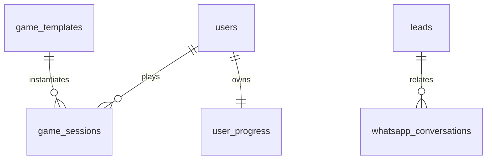

# Mathematics Geek Database Schema (MongoDB)

This document describes the collections, Pydantic representations, and indexes used in the MongoDB database for **mathematicsgeek.com**.

---

## Collections Overview

### 1. `users`
Stores accounts for students, parents, or teachers who register on the platform.
* **Fields**:
  * `id` (UUID string, unique): Unique identifier.
  * `name` (string): Full name.
  * `email` (string, sparse unique): Contact email.
  * `phone` (string, sparse unique): Mobile contact.
  * `role` (string): `"student"`, `"parent"`, or `"teacher"`.
  * `class` (string): Selected grade/level.
  * `board` (string): Selected curriculum board.
  * `password_hash` (string): Hashed authentication password.
  * `created_at` (ISO string): Timestamp.
  * `updated_at` (ISO string): Timestamp.

### 2. `leads` (inquiries)
Stores demo class inquiries submitted via website form or captured via WhatsApp Bot.
* **Fields**:
  * `id` (UUID string, unique): Unique identifier.
  * `name` (string): Lead name.
  * `phone` (string): Contact phone number.
  * `email` (string): Optional email.
  * `city` (string): Optional city.
  * `state` (string): Optional state.
  * `country` (string): Default is `"India"`.
  * `student_class` (string): Academic grade.
  * `board` (string): Selected board (CBSE, ICSE, etc.).
  * `preferred_mode` (string): `Online Live Sessions`, `Offline Home Tuitions`, etc.
  * `message` (string): Optional message detailing focus areas.
  * `source` (string): `"website"` or `"whatsapp"`.
  * `status` (string): `"pending"`, `"contacted"`, `"enrolled"`, `"lost"`.
  * `whatsapp_engaged` (boolean): Flag set if lead entered from the WhatsApp flow.
  * `tags` (array of strings): Behavioral tags, e.g., `["whatsapp", "vedic_math"]`.
  * `created_at` (ISO string): Timestamp.
  * `updated_at` (ISO string): Timestamp.

### 3. `game_templates`
Predefined configurations for gamified learning activities.
* **Fields**:
  * `id` (UUID string, unique): Unique template ID.
  * `name` (string): Game title.
  * `type` (string): `"mental_math"`, `"timed_quiz"`, `"vedic_tricks"`, `"daily_challenge"`.
  * `description` (string): Rules and summary of the game.
  * `config` (object):
    * `time_limit` (integer): Seconds to complete the game.
    * `question_count` (integer): Total questions.
    * `difficulty_min` (integer): 1-5 range.
    * `difficulty_max` (integer): 1-5 range.
    * `topics` (array): List of math topics included.
    * `operations` (array): Math operations included.
  * `topic` (string): Primary topic tag.
  * `class_range` (array of integers): e.g., `[6, 7, 8]`.
  * `active` (boolean): Template status.
  * `created_at` (ISO string): Timestamp.

### 4. `game_sessions`
Active or historical gameplay instances started by players.
* **Fields**:
  * `id` (UUID string, unique): Unique session ID.
  * `template_id` (string): Associated template ID.
  * `player_name` (string): Nickname of the player.
  * `score` (integer): Correct answers count.
  * `total` (integer): Total questions served.
  * `time_taken` (float): Cumulative answer response times.
  * `streak` (integer): Active streak of correct answers.
  * `best_streak` (integer): Best streak achieved in this session.
  * `xp_earned` (integer): XP points awarded.
  * `status` (string): `"active"`, `"completed"`, `"abandoned"`.
  * `questions` (array of objects): Complete set of questions served.
  * `answers` (array of objects): Submitted answers, speeds, and correctness metrics.
  * `started_at` (ISO string): Timestamp.
  * `completed_at` (ISO string, optional): Completion timestamp.

### 5. `user_progress`
Maintains accumulated stats, levels, and badges earned by players.
* **Fields**:
  * `id` (UUID string, unique): Unique tracking ID.
  * `player_name` (string, unique): Player identifier.
  * `total_xp` (integer): Cumulative XP.
  * `level` (integer): Current level (XP / 100).
  * `games_played` (integer): Total plays.
  * `total_correct` (integer): Total correct answers.
  * `total_answered` (integer): Total questions attempted.
  * `streak_best` (integer): High score streak.
  * `daily_streak` (integer): Days played in succession.
  * `topic_scores` (object): Nested maps detailing correctness by topic.
  * `badges` (array of strings): Earned badges, e.g. `["speed_demon", "algebra_pro"]`.
  * `last_played` (ISO string): Timestamp.
  * `updated_at` (ISO string): Timestamp.

### 6. `blog_posts`
Contains article copy and SEO meta tags for the content engine.
* **Fields**:
  * `id` (UUID string, unique): Unique identifier.
  * `title` (string): Post title.
  * `slug` (string, unique): URL slug.
  * `excerpt` (string): Short description.
  * `content` (string): Markdown content body.
  * `featured_image` (string): Image URL.
  * `category` (string): Category name.
  * `tags` (array of strings): Post tag filters.
  * `meta_title` (string): Custom SEO page title.
  * `meta_description` (string): Custom page description.
  * `meta_keywords` (array of strings): Keyword index.
  * `author` (string): Default is `"Aarti Agarwal"`.
  * `read_time` (integer): Estimate in minutes.
  * `status` (string): `"draft"` or `"published"`.
  * `views` (integer): Count of views.
  * `created_at` (ISO string): Creation timestamp.
  * `updated_at` (ISO string): Last updated timestamp.

### 7. `whatsapp_conversations`
Maintains current state machine parameters for active WhatsApp Bot chats.
* **Fields**:
  * `id` (UUID string, unique): Unique identifier.
  * `phone` (string, unique): Player's phone number.
  * `state` (string): Conversation state, e.g., `"awaiting_name"`, `"challenge_sent"`.
  * `context` (object): Temporary session context keys (names, class, active question).
  * `messages` (array of objects): Chronological history of messages exchanged.
  * `lead_id` (string, optional): Associated lead ID once created.
  * `created_at` (ISO string): Timestamp.
  * `updated_at` (ISO string): Timestamp.

---

## Index Definitions

Database initialization creates the following indexes for high-speed lookups:

| Collection | Fields | Type | Properties |
|------------|--------|------|------------|
| `leads` | `status` | Single | Standard |
| `leads` | `created_at` | Single | Standard |
| `leads` | `phone` | Single | Unique, Sparse |
| `blog_posts` | `slug` | Single | Unique |
| `blog_posts` | `status` | Single | Standard |
| `blog_posts` | `category` | Single | Standard |
| `blog_posts` | `tags` | Multikey | Standard |
| `testimonials` | `approved` | Single | Standard |
| `game_templates` | `active` | Single | Standard |
| `game_templates` | `topic` | Single | Standard |
| `game_sessions` | `user_id` | Single | Standard |
| `game_sessions` | `template_id` | Single | Standard |
| `game_sessions` | `score` | Single (desc) | Standard |
| `user_progress` | `user_id` | Single | Unique |
| `user_progress` | `total_xp` | Single (desc) | Standard |
| `questions` | `topic` | Single | Standard |
| `questions` | `difficulty` | Single | Standard |
| `questions` | `topic, difficulty` | Compound | Standard |
| `whatsapp_conversations` | `phone` | Single | Unique |
